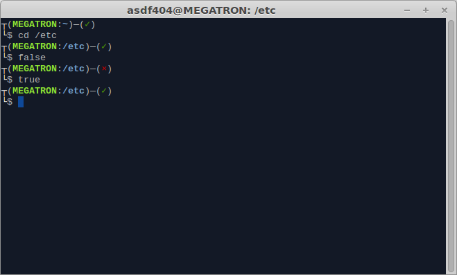

bashrc
======
Описание
--------

Мой .bashrc. Умеет:
* показывать статус выполнения предыдущей команды;
* показывать текущую ветку git;
* исправлять некорректно введённый путь (например `cd /var/lbi` будет исправлен на `cd /var/lib`).

Установка
---------
```
cd /path/to/bashrc
chmod +x ./install.sh
./install.sh
source ~/.bashrc
```